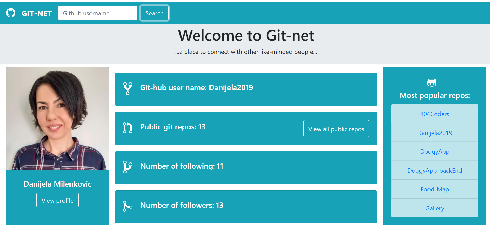

# Git-net

## Introduction

This is a small application for searching github users, using the Github API and get some usefull data about them.The project was created using React and styled with the React Bootstrap library.
#### Proview of the app is available [here](https://githubnet.netlify.app)

## Functionality:

- **Search by username into the search field( for now that is the only available option)**
- **View all public repositories from a user**

|  |
| :---------------------------: |
|     Git-net desktop image     |

## How to use it

- **Clone the repo: git@github.com:Danijela2019/Git-net.git**
- **Position yourself in the github-net folder**
- **Install packages: npm install**
- **Run this command in your terminal 'npm start'**
- **View the application in the browser(http://localhost:3000)**
